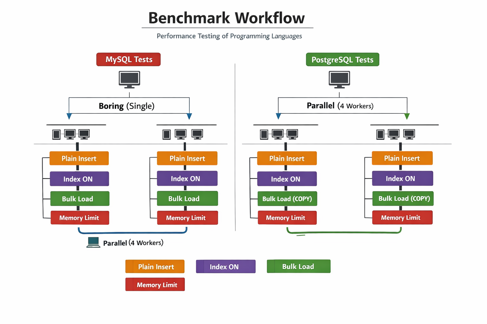

# Database Ingestion Benchmark Rules

This document defines the **complete, reproducible process** for benchmarking CSV → Database insertion performance across multiple programming languages.

The goal is clarity, fairness, and repeatability.

---

## 🎯 Objective

Measure **wall-clock time** required to insert **1,000,000 rows from a CSV file** into a database.  
Also measure **CPU and memory usage spikes** during the run.

Focus:

- CSV streaming & parsing
- Database driver efficiency
- Transaction handling
- Concurrency model behavior
- Database engine behavior

Not measured:

- Framework performance
- ORM abstractions
- Business logic
- Query optimization skills

---

## 🧠 Languages Tested

- PHP
- Node.js
- Python
- Go
- Rust
- Dart

Each language must use:

- Official/widely-accepted DB driver
- Minimal dependencies
- No framework bootstrapping

---

## 🗄️ Databases Tested

- **MySQL (InnoDB)**
- **PostgreSQL**

Same schema and CSV file are used for fairness.

---

## 📄 CSV Dataset Rules

- Exactly 1,000,000 rows
- Shared CSV for all tests
- Medium-width schema (8–12 columns)
- Stored on local disk

CSV Example:

```
id,Name,Description,Brand,Category,Price,Currency,Stock,EAN,Color,Size,Availability,Internal ID
1,Portable Fan,Person agency practice lose high book.,Conley-Noble,Men's Clothing,654,USD,752,3247000000000,NavajoWhite,50x70 cm,out_of_stock,46
2,Mini Oven Speaker Fan Automatic Max Pro,All contain because mind guess control around speak.,Becker, Wiggins and Drake,Makeup,739,USD,676,4395620000000,Navy,12x18 in,in_stock,94
3,Wireless Lamp,Source your adult produce station smile recently.,Bowman, Lee and Hampton,Automotive,52,USD,556,4918980000000,Snow,Small,out_of_stock,51
```

Schema:

| Column       | Type                                                                                       |
| ------------ | ------------------------------------------------------------------------------------------ |
| id           | INT                                                                                        |
| Name         | VARCHAR(255)                                                                               |
| Description  | TEXT                                                                                       |
| Brand        | VARCHAR(255)                                                                               |
| Category     | VARCHAR(100)                                                                               |
| Price        | DECIMAL(10,2)                                                                              |
| Currency     | CHAR(3)                                                                                    |
| Stock        | INT                                                                                        |
| EAN          | VARCHAR(20)                                                                                |
| Color        | VARCHAR(50)                                                                                |
| Size         | VARCHAR(50)                                                                                |
| Availability | ENUM('in_stock','out_of_stock', 'limited_stock', 'discontinued', 'pre_order', 'backorder') |
| Internal ID  | INT                                                                                        |

---

## 🧱 Table Rules

- **Static table names** per DB/mode/variant (no dynamic selection)
- No AUTO_INCREMENT
- Primary key provided by CSV
- No foreign keys
- Indexes only in specific variants
- Tables must exist before benchmark
- Truncate before each run

### MySQL Example

- `products_mysql_boring_plain`
- `products_mysql_boring_index`
- `products_mysql_boring_load`
- `products_mysql_boring_memory`
- `products_mysql_parallel_plain` … etc.

### PostgreSQL Example

- `products_pg_boring_plain`
- `products_pg_boring_index`
- `products_pg_boring_copy`
- `products_pg_boring_memory`
- `products_pg_parallel_plain` … etc.

---

## 🔁 Execution Protocol

1. Restart database
2. Truncate target table
3. Clear OS disk cache (optional)
4. Run benchmark
5. Log metrics
6. Repeat 3 times per scenario (average results)

---

## ⚡ Worker & Memory Settings

**Workers:**

- Boring: 1 worker
- Parallel: 4 workers

**Memory Limits (Memory Pressure Variant):**

- PHP: 512MB
- Node.js: 512MB
- Python: 512–1024MB
- Go: 256–512MB
- Rust: 256MB
- Dart: 512MB

**Batch size:** 1000 rows

---

## 🧪 Base Scenarios

1. **MySQL – Boring**: single process, single connection, one transaction
2. **MySQL – Parallel**: 4 workers, one connection per worker
3. **PostgreSQL – Boring**: same as MySQL boring
4. **PostgreSQL – Parallel**: same as MySQL parallel

---

## ⭐ Bonus Variants (per Base Scenario)

- **Variant A – Plain Insert**: Batched INSERT, no indexes
- **Variant B – Index ON**: Same as A but with 1 BTREE + 1 composite index
- **Variant C – Native Bulk Load**: MySQL LOAD DATA / PostgreSQL COPY
- **Variant D – Memory Pressure**: same as A with RAM limit

---

## 📊 Metrics to Record

- Total runtime
- Rows per second
- Progress logs every 100k rows
- Errors
- Peak memory usage (graph)
- CPU usage spikes (graph)

---

## 📈 Graphs to Capture

- Total Time per Language
- Speedup: Boring vs Parallel
- Index Degradation
- DB Comparison MySQL vs PostgreSQL
- Memory Usage over Time
- CPU Usage over Time

---

## ✅ Freeze Rules

- Do not change batch size, schema, transaction rules, or concurrency for boring mode
- Only tweak memory limit, number of repeats, optional graph logging

---

## 🖼️ Benchmark Workflow Diagram (Image)



---

## 🖼️ Benchmark Workflow Diagram (Mermaid)



```mermaid
flowchart TD
    CSV[CSV File: 1M Rows]

    subgraph MySQL_Boring[MySQL - Boring]
        MB_A[Variant A: Plain Insert]
        MB_B[Variant B: Index ON]
        MB_C[Variant C: LOAD DATA]
        MB_D[Variant D: Memory Pressure]
    end

    subgraph MySQL_Parallel[MySQL - Parallel]
        MP_A[Variant A: Plain Insert]
        MP_B[Variant B: Index ON]
        MP_C[Variant C: LOAD DATA]
        MP_D[Variant D: Memory Pressure]
    end

    subgraph PG_Boring[PostgreSQL - Boring]
        PB_A[Variant A: Plain Insert]
        PB_B[Variant B: Index ON]
        PB_C[Variant C: COPY]
        PB_D[Variant D: Memory Pressure]
    end

    subgraph PG_Parallel[PostgreSQL - Parallel]
        PP_A[Variant A: Plain Insert]
        PP_B[Variant B: Index ON]
        PP_C[Variant C: COPY]
        PP_D[Variant D: Memory Pressure]
    end

    CSV --> MySQL_Boring
    CSV --> MySQL_Parallel
    CSV --> PG_Boring
    CSV --> PG_Parallel

    MB_A --> Metrics[Metrics Logging: Time, Rows/sec, Memory, CPU]
    MB_B --> Metrics
    MB_C --> Metrics
    MB_D --> Metrics

    MP_A --> Metrics
    MP_B --> Metrics
    MP_C --> Metrics
    MP_D --> Metrics

    PB_A --> Metrics
    PB_B --> Metrics
    PB_C --> Metrics
    PB_D --> Metrics

    PP_A --> Metrics
    PP_B --> Metrics
    PP_C --> Metrics
    PP_D --> Metrics

```

This mermaid diagram shows the **full benchmark workflow** from CSV → Base Scenario → Bonus Variant → Metrics logging.
