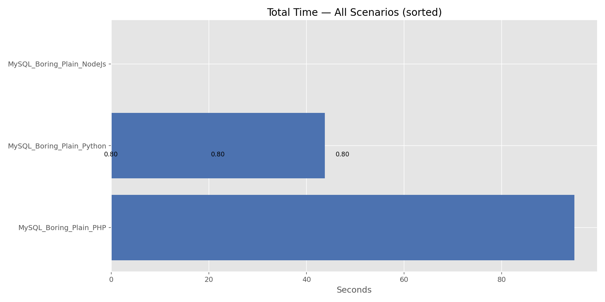
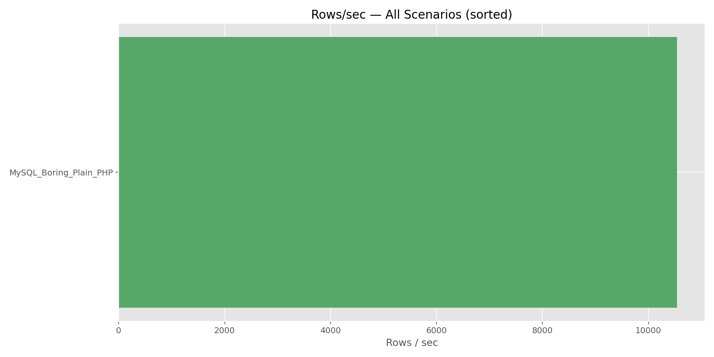
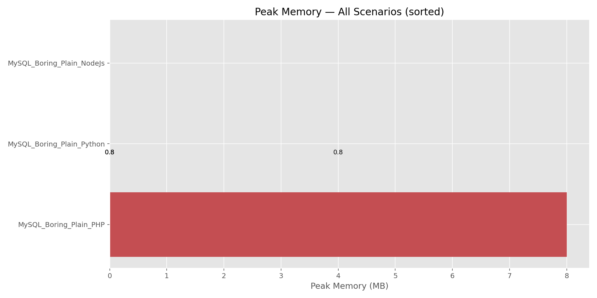
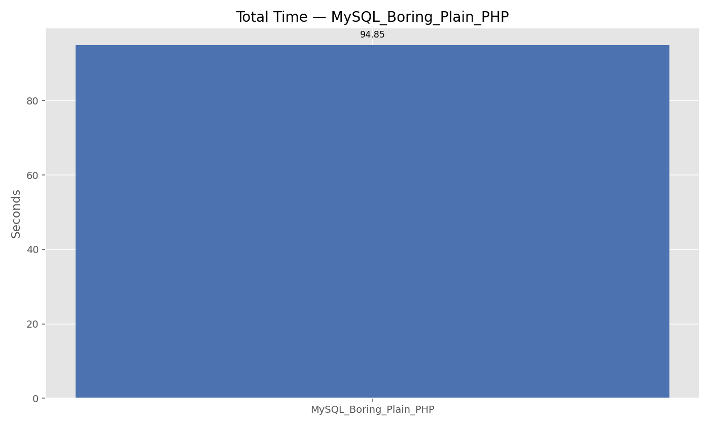
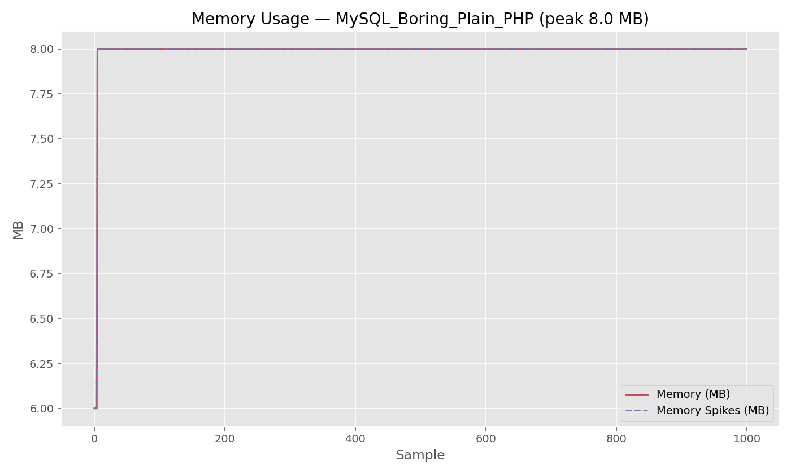
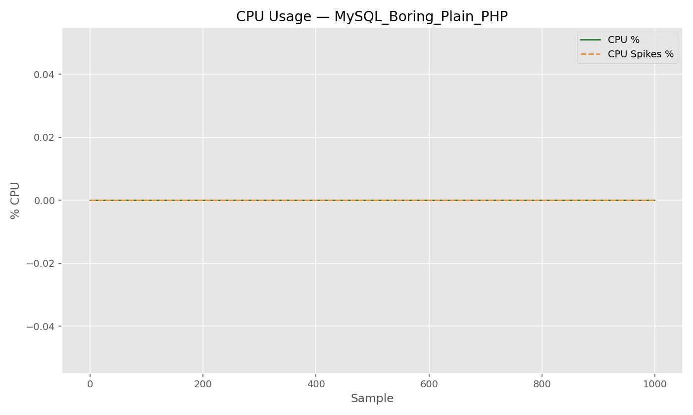
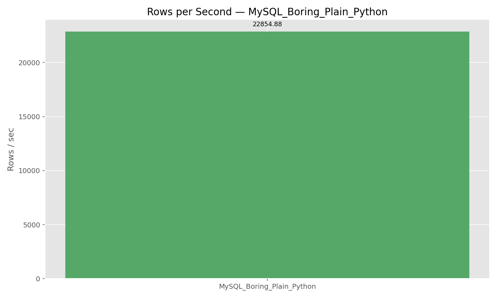
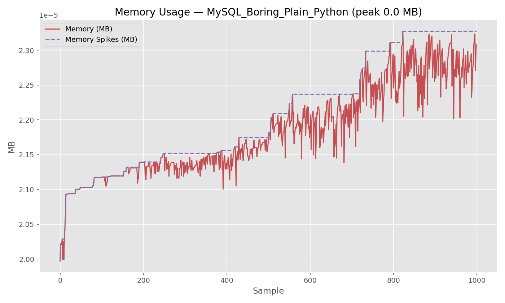
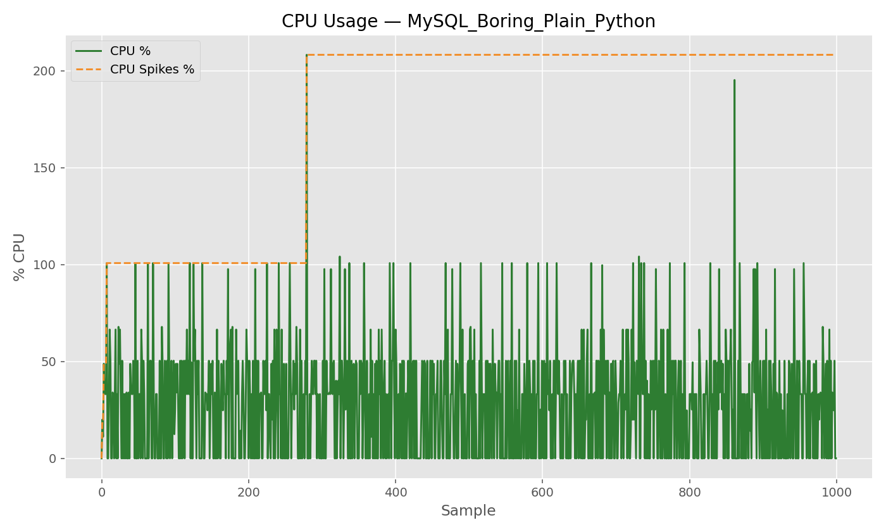

# Database Ingestion Benchmark Results

This file contains the results of all CSV → Database ingestion benchmarks, including time, throughput, memory, and CPU metrics.

---

## 🗂️ Summary Table

| DB    | Mode     | Variant | Language | Total Rows         | Total Time (s)     | Rows/sec           | Peak Memory (MB)   | Peak CPU (%)       |
| ----- | -------- | ------- | -------- | ------------------ | ------------------ | ------------------ | ------------------ | ------------------ |
| MySQL | Boring   | Plain   | PHP      | 1000000            | 94.85              | 10542.89           | 8                  |                    |
| MySQL | Boring   | Index   | PHP      |                    |                    |                    |                    |                    |
| MySQL | Boring   | Load    | PHP      |                    |                    |                    |                    |                    |
| MySQL | Boring   | Memory  | PHP      |                    |                    |                    |                    |                    |
| MySQL | Parallel | Plain   | PHP      |                    |                    |                    |                    |                    |
| MySQL | Boring   | Plain   | Nodejs   | Machine Crashed 🤡 | Machine Crashed 🤡 | Machine Crashed 🤡 | Machine Crashed 🤡 | Machine Crashed 🤡 |
| MySQL | Boring   | Plain   | Python   | 1000000            | 43.75              | 22854.88           | 24.4               | 208.3              |
| MySQL | Boring   | Index   | Nodejs   |                    |                    |                    |                    |                    |
| MySQL | Boring   | Load    | Nodejs   |                    |                    |                    |                    |                    |
| MySQL | Boring   | Memory  | Nodejs   |                    |                    |                    |                    |                    |
| MySQL | Parallel | Plain   | Nodejs   |                    |                    |                    |                    |                    |
| ...   | ...      | ...     | ...      | ...                | ...                | ...                | ...                | ...                |

> Copy this table for each language (Node.js, Python, Go, Rust, Dart)

---

## 📊 Graphs

### 1. Total Time per Scenario

### 2. Rows/sec per Scenario

### 3. Peak Memory per Scenario

---

## ⚡ Notes

- Each run is repeated 3 times; reported metrics are **averages**
- Errors and exceptions are logged per run (see `logs/` folder if applicable)
- Graphs are generated from JSON metrics files located in `results/`

- Known failure: The Node.js `mysql_boring_a_plain` import crashed on some runs (spawn UNKNOWN / pidusage or duplicate-key errors). Metrics for that run may be incomplete or missing in `results/` — check the terminal or `results/mysql_boring_a_plain_node.json` for partial output.

---

## 🗂️ Per-Language Sections

You can optionally add a section per language with **all variants detailed**:

### PHP

| DB         | Mode     | Variant | Total Time (s) | Rows/sec | Peak Memory (MB) | Peak CPU (%) |
| ---------- | -------- | ------- | -------------- | -------- | ---------------- | ------------ |
| MySQL      | Boring   | Plain   | 94.85          | 10542.89 | 8                |              |
| MySQL      | Parallel | Plain   |                |          |                  |              |
| PostgreSQL | Boring   | Copy    |                |          |                  |              |
| ...        | ...      | ...     | ...            | ...      | ...              | ...          |

#### Graphs

- Total Time: 
- Rows/sec: 
- Memory Usage: 
- Memory Spikes: 
- CPU Usage: 
- CPU Spikes: 

> Repeat the above for Node.js, Python, Go, Rust, Dart

---

### Python

| DB         | Mode     | Variant | Total Time (s) | Rows/sec | Peak Memory (MB) | Peak CPU (%) |
| ---------- | -------- | ------- | -------------- | -------- | ---------------- | ------------ |
| MySQL      | Boring   | Plain   | 43.75          | 22854.88 | 24.4             | 208.3        |
| MySQL      | Parallel | Plain   |                |          |                  |              |
| PostgreSQL | Boring   | Copy    |                |          |                  |              |
| ...        | ...      | ...     | ...            | ...      | ...              | ...          |

#### Graphs

- Total Time: 
- Rows/sec: 
- Memory Usage: 
- Memory Spikes: 
- CPU Usage: 
- CPU Spikes: 

---

## ✅ Usage

1. Run benchmarks per scenario → generates JSON in `results/`
2. Copy metrics into the tables above
3. Generate graphs using Python script → save into `graphs/`
4. Replace placeholders in this file with graph images
5. Review results and compare across languages, DBs, modes, and variants
